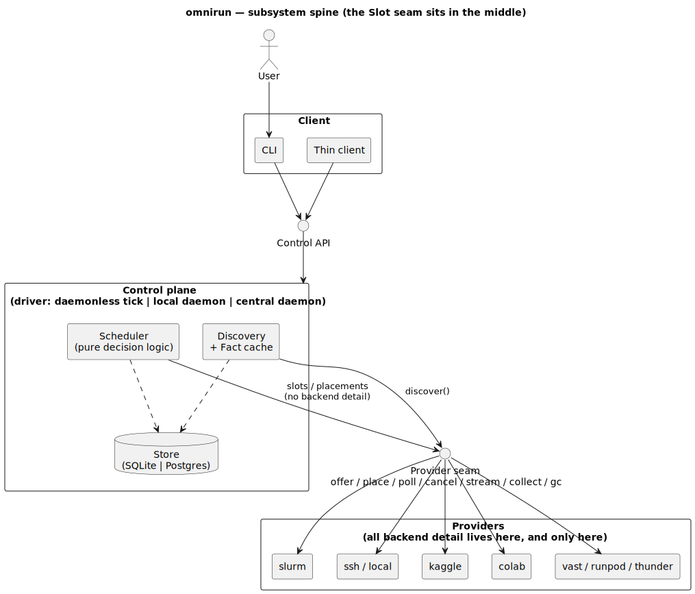
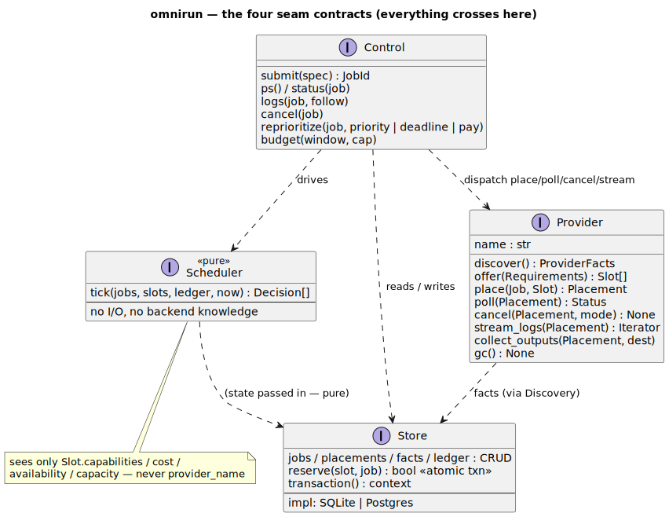
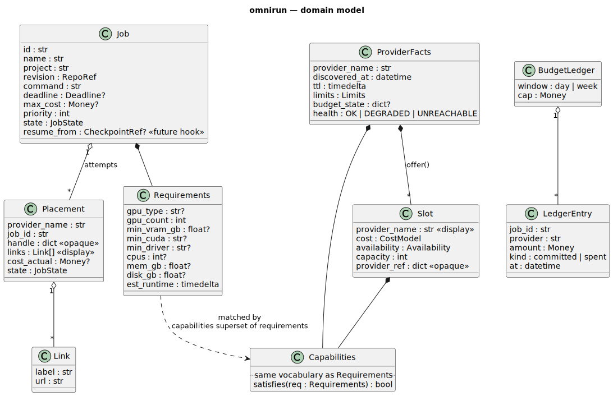
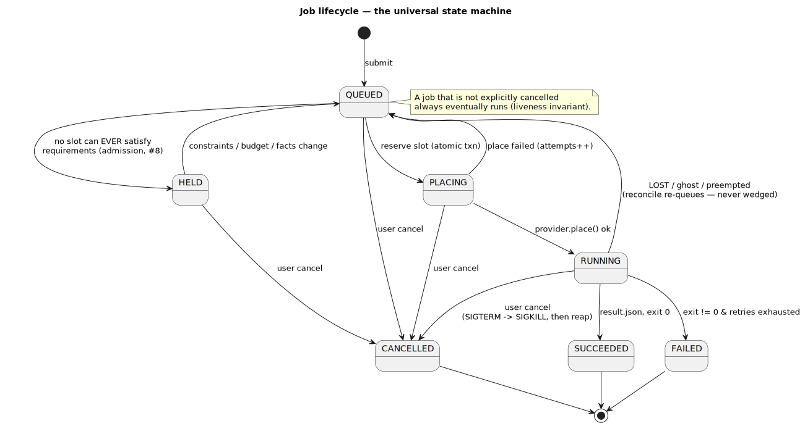
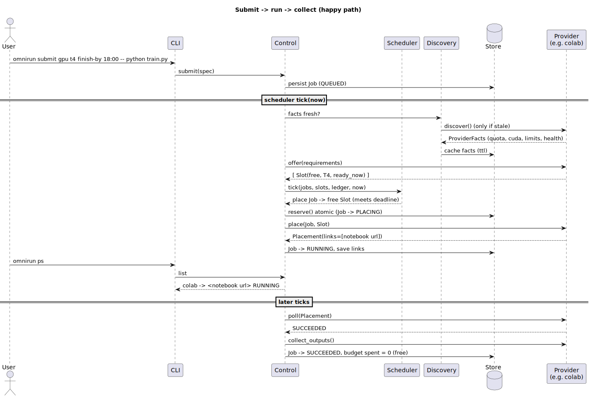
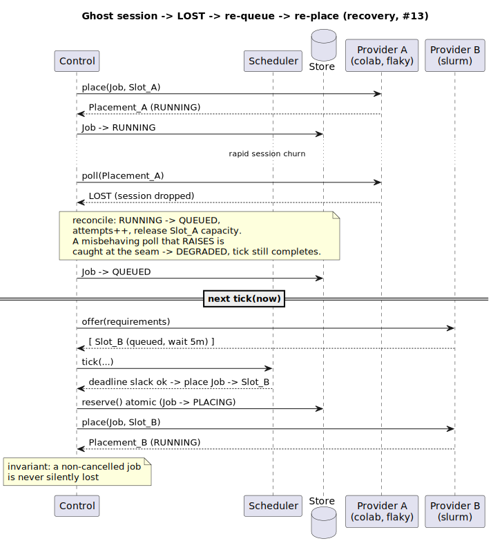
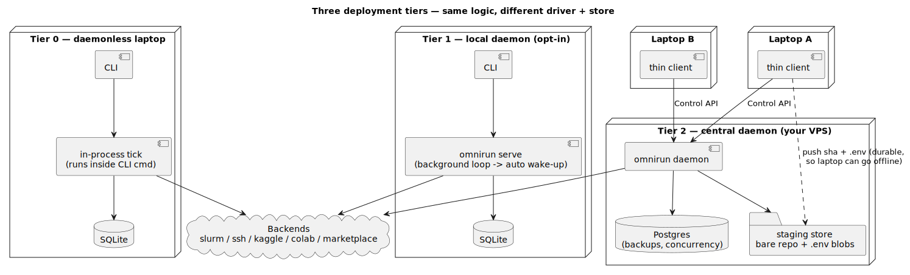

# omnirun — scheduler redesign (design spec)

> **Status:** design, approved for planning 2026-07-11. Supersedes the ad-hoc
> chooser + optional-queue model in [`../../../DESIGN.md`](../../../DESIGN.md) §4 and §9
> with a single scheduler that *owns job lifecycle and backend knowledge*.
> Diagrams: PlantUML sources in [`diagrams/`](./diagrams/), rendered SVGs referenced inline.

## 1. Why

Today omnirun is a **dispatcher**: the caller names a backend, `submit` fires the job,
and state is polled best-effort. Three failure modes recur, all the same root cause —
*omnirun does not know enough about its backends*:

- It **admits doomed jobs** — a torch wheel vs. an old host driver (#8), a walltime past a
  Slurm partition's `MaxTime`, an unentitled premium notebook tier.
- It **loses track of whether a backend is operational** — rapid Colab session churn makes
  live jobs report `LOST` (#13); a dropped ssh connection is indistinguishable from a dead job.
- It **can't take responsibility for placement** — the human must know backend names, quotas,
  and limits (#9), and coordinate nothing across the multiple projects/machines they run.

The redesign makes omnirun a **scheduler that owns the lifecycle**: it learns each backend's
real capabilities and limits *before* a job runs, refuses or holds what cannot succeed, places
work on the cheapest option that meets a deadline within a budget, and recovers from backend
misbehaviour without silently dropping a job. The user thinks about **what hardware, by when,
and how much they'll pay** — never *where*.

It must scale from a one-shot `omnirun submit` on a laptop to hundreds of jobs across
multiple projects and machines over weeks, and it must be simpler than today, not more complex.

## 2. Principles (the rules that keep it modular)

1. **The scheduler is pure and slot-blind.** It reasons over an abstract market of `Slot`s
   (capability, cost, availability, capacity). It has *zero* backend branches and never reads a
   provider's name for a decision. This is what makes it unit- and property-testable, and what
   lets a new backend land without touching it.
2. **All backend detail lives below the Provider seam.** ssh, sbatch, kernels API, REST — every
   backend-specific line is inside a `Provider`. Above the seam: only `Slot`, `Placement`, `Status`.
3. **Fit is one generic predicate.** `Capabilities.satisfies(Requirements)` — a superset check.
   A new constraint is a new key both sides read, never a new `if` in the scheduler.
4. **Re-queue is the universal recovery primitive.** A non-cancelled job that is lost, preempted,
   or whose placement failed goes back to `QUEUED`. One rule replaces scattered LOST/retry code and
   is the seam future features (spot, checkpoint-restart) reuse.
5. **Knowledge is discovered and remembered, not guessed.** A per-backend `discover()` populates a
   TTL'd fact cache; admission and ranking read it. *Fail-and-remember is the exception*, for facts
   only visible after the fact.
6. **Presentation data ≠ decision data.** `provider_name` and `Placement.links` (notebook URL,
   kernel URL, dashboard, Slurm job-id) ride the seam for the human to see and follow; the scheduler
   ignores them.
7. **No mandatory control plane.** The scheduler is a library. *Who* drives its tick and *where*
   state lives are the only differences between a daemonless laptop, a local daemon, and a central
   daemon. (Carries over from today's design.)
8. **Unchanged below the job envelope.** The single `bootstrap.sh` payload, the shared per-project
   worker layout (`.trees/<sha12>`, one `.venv`), and the credential-safe repo delivery
   (`refs/omnirun/<sha12>`, public direct-clone, bundle) are retained verbatim
   ([`../../../DESIGN.md`](../../../DESIGN.md) §3, §6). This redesign is *above* that line.

## 3. Subsystem spine

Six layers, each talking to its neighbours through one narrow interface.



The seam that carries the weight is between **Scheduler** and **Providers**: it is *only* `Slot`s
going up and `place/poll/cancel/stream` going down. **Discovery** turns `provider.discover()` into
cached `ProviderFacts` in the **Store**; the scheduler and admission read facts, never a live
backend. The **Store** is SQL behind a repository interface (SQLite or Postgres). The **Control
plane** is the scheduler + discovery + store wrapped by one of three drivers.

## 4. The seam contracts



```python
class Provider(Protocol):
    name: str
    def discover(self) -> ProviderFacts: ...          # capabilities, limits, quota, health
    def offer(self, req: Requirements) -> list[Slot]: ...   # facts + live availability -> fitting slots
    def place(self, job: Job, slot: Slot) -> Placement: ...
    def poll(self, p: Placement) -> Status: ...
    def cancel(self, p: Placement, mode: CancelMode) -> None: ...   # graceful | force
    def stream_logs(self, p: Placement) -> Iterator[str]: ...
    def collect_outputs(self, p: Placement, dest: Path) -> None: ...
    def gc(self) -> None: ...

class Store(Protocol):        # SQLite | Postgres behind one dialect layer
    def reserve(self, slot: Slot, job: Job) -> bool: ...   # atomic: capacity-- & job->PLACING
    def transaction(self) -> AbstractContextManager[Txn]: ...
    # + typed CRUD for jobs / placements / facts / ledger

class Scheduler(Protocol):    # PURE — no I/O, no backend knowledge
    def tick(self, jobs, slots, ledger, now) -> list[Decision]: ...

class Control(Protocol):      # the only surface a client touches
    def submit(self, spec) -> JobId: ...
    def ps(self) -> list[JobView]: ...        # includes provider_name + links
    def status(self, job) -> JobView: ...
    def logs(self, job, follow: bool) -> Iterator[str]: ...
    def cancel(self, job) -> None: ...
    def reprioritize(self, job, *, priority=None, deadline=None, allow_paid=None) -> None: ...
    def budget(self, window, cap) -> None: ...
```

Each provider maps its native signals into the uniform `Status`. Everything backend-specific stops
at this boundary.

## 5. Domain model



```
Job         id, name, project, revision(url,sha,delivery), command,
            requirements, env, outputs,
            deadline: start_by | finish_by | None, max_cost | None,
            priority (int, reprioritizable), state,
            resume_from: CheckpointRef | None,     # future hook, unused in v1
            attempts: [Attempt]                    # placement history / audit

Requirements  gpu{type?, count, min_vram?}, min_cuda?, min_driver?,
              cpus?, mem?, disk?, est_runtime      # a capability DEMAND

Capabilities  same vocabulary as Requirements; .satisfies(req) -> bool   # capabilities ⊇ requirements

Slot          provider_name (display), capabilities, cost(free | {setup?, per_hour}),
              availability(ready_now | queued(wait, note) | provision(latency)),
              capacity (remaining concurrent jobs), provider_ref (opaque)

Placement     provider_name, job_id, handle(opaque),
              links: [Link]  (notebook / kernel / dashboard / job-id),   # human-facing
              cost_actual, state, timestamps

ProviderFacts provider_name, discovered_at, ttl, static_caps, limits{max_parallel, max_walltime, ...},
              budget_state{quota_remaining?, ...}, health: OK | DEGRADED(reason) | UNREACHABLE(reason)

BudgetLedger  window(day|week), cap, entries[(job, provider, amount, committed|spent, at)]
```

`committed` is reserved at placement, `spent` realized on completion; the global wallet is the sum
in the current window.

## 6. Backend knowledge — discovery + fact cache

The primary mechanism is **reliable, proactive discovery**, remembered before a job runs. Per backend:

| Backend | Discovered facts (source) |
|---|---|
| **Slurm** | per-partition `MaxSubmitJobs`/`MaxJobs`, `MaxTime`, gres GPU types+counts, CUDA/driver — `scontrol show partition`, `sacctmgr show qos`, `sinfo`, `module avail cuda` / `nvidia-smi` on a node |
| **Kaggle** | remaining weekly GPU/TPU hours + refresh time — `KaggleApi.quota_view()` (`ApiGetAcceleratorQuotaStatisticsResponse`); session cap; entitled tiers. **Not** local accounting. |
| **Colab** | entitled tiers + compute-unit / balance, session cap — via `google-colab-cli` |
| **Marketplace** | per-offer driver/CUDA (vast `cuda_max_good`), price, availability — search API, **pre-rent** so #8 is a filter, not a surprise |
| **ssh/slurm login** | reachability + health over the user's own `ssh` |

**Hard requirement (bug fix):** omnirun connects **only through the user's own `ssh`** — honoring
their PATH wrapper and `~/.ssh/config` — and must never construct an auth path that defeats it
(no hardcoded `ssh` path, no `BatchMode`/option that bypasses a password-removing wrapper). Today
`omnirun backends check` prompts for a password despite such a wrapper; that is the concrete symptom
to eliminate. All discovery rides on this connection working the way the user already made it work.

**Freshness.** Facts carry a TTL. In the daemon tiers a background loop refreshes proactively; in the
daemonless tier discovery runs on demand and is cached, refreshed when stale or on `omnirun backends
discover`. **Health** lives here too: a provider that fails discovery or repeatedly fails placement is
marked `DEGRADED`/`UNREACHABLE` and offered no slots until it recovers (circuit breaker).

## 7. The scheduler — deadline + budget



**Willingness-to-pay model.** The user sets a **global budget envelope** (spend cap per day/week —
one wallet per user) and, per job, an optional **deadline** (`start_by` or `finish_by`) and
`max_cost`. The scheduler is **free-first**: a job with deadline slack runs free; when free cannot
meet the deadline it escalates to the cheapest paid option that fits — *only within budget*. While a
job is queued the user can **reprioritize or opt it into paid** at any time.

**The tick — a pure function `(jobs, slots, ledger, now) -> decisions`** (the identical call in
daemonless and daemon paths; `now` is a parameter, so it is deterministic):

```
1. Reconcile   fold provider Statuses into job states; a LOST/ghost/preempted placement ->
               job back to QUEUED (attempts++), release its slot capacity.
2. Admit       a QUEUED job for which NO slot could ever satisfy requirements -> HELD(reason).   [#8]
3. Rank        ready jobs by (priority, deadline urgency, age).
4. Match       candidates = slots where capabilities ⊇ requirements and capacity > 0:
                 • a free slot whose availability still meets the deadline -> take it;
                 • else last-responsible-moment: the cheapest PAID slot that (a) meets finish_by,
                   (b) ≤ max_cost, (c) fits the remaining budget window -> escalate;
                 • none affordable -> stay QUEUED at raised priority (runs late, never refused).
5. Reserve     capacity-- and job -> PLACING in ONE Store transaction (row lock), so concurrent
               ticks / other machines cannot double-book.                                        [#12]
6. Emit        (job, slot) decisions -> provider.place(); commit the budget entry.
```

**Semantics locked with the user:**
- **Deadline unmeetable** (even fastest paid too slow, or budget spent): the job is **not refused
  and not killed** — it stays queued at elevated priority and runs on the next fitting free slot.
  *A job that isn't explicitly cancelled always eventually runs.*
- **`finish_by` is actively defended within budget:** the scheduler watches wait estimates and
  pre-emptively escalates a free job to paid before the window closes — but never past the budget,
  and never spends while free still meets the deadline (no premature spend).

### 7a. Happy path



### 7b. Failure & recovery



A dropped session, a preemption, a `poll` that raises — all funnel to the same re-queue, and a
provider that *misbehaves* (raises/times-out/garbles) is caught at the seam and degraded without
crashing the tick.

## 8. Uniform lifecycle — cancel & streaming logs

- **Cancel** is one semantic on every backend: graceful `SIGTERM` (so signal-handling jobs
  checkpoint/clean up), then `SIGKILL` after a timeout, then **reap** any provisioned resource
  (terminate the marketplace instance, `scancel`, stop the kernel/session) so cancellation never
  leaves a half-dead job or a billing instance. `CancelMode = graceful | force`.
- **Streaming logs** (`stream_logs`) delivers stdout/stderr as produced on *any* backend — the
  worker appends to `logs/`, and the provider tails it (ssh: tail over the connection; notebooks:
  incremental reads; marketplace: tail over ssh). In the daemon tiers the daemon multiplexes one
  worker stream to many followers. `omnirun logs -f` works uniformly and can cancel from the view.
  (This subsumes #4.)

## 9. State layer & SQL abstraction

Scheduler/discovery use the `Store` repository interface; underneath, **one portable SQL core** runs
on **SQLite** (laptop, daemonless — zero setup) or **Postgres** (the VPS — backups, real concurrency,
cloud deploys). Atomic slot reservation uses the DB transaction / row lock, which is exactly what
serializes the shared-venv race (#12) and prevents two machines double-booking a backend.

**Decision (to be justified in the Phase-2 spec):** SQLAlchemy Core 2.0 (not the ORM) as the dialect
layer — typed cleanly enough to pass basedpyright with no `# type: ignore`, and speaks both engines
without hand-written dialect branches. The repository interface keeps SQLAlchemy out of the scheduler
and providers regardless, so the engine choice is swappable.

## 10. Deployment tiers & the trust boundary



- **Tier 0 — daemonless laptop:** local SQLite; the tick runs synchronously inside CLI commands.
  No background process, no auto-wakeup (the accepted price). Preserves the daemonless invariant.
- **Tier 1 — local daemon (opt-in):** same logic, a background loop drives the tick → auto-wakeup.
- **Tier 2 — central daemon (your VPS):** Postgres; every machine is a thin client speaking the
  Control API. Global queue, global budget, backend knowledge in one place; reprioritize from anywhere.

**Trust boundary (conscious change to a load-bearing invariant).** With deferred placement the laptop
may be offline when the daemon places a job, so code + the gitignored `.env` cannot live only on the
laptop. At **enqueue** time the client durably stages into **the daemon host you run**: it pushes the
exact sha to a bare repo on the VPS and uploads `.env` as a blob; the daemon then delivers VPS→backend
exactly as a laptop does today. The invariant softens from *"secrets never leave the laptop"* to
**"origin git credentials never leave the laptop; code + secrets are entrusted only to the daemon host
you run."** Public repos still ship only URL+sha (worker clones directly; nothing lands on the VPS).

## 11. Testability & invariants

The pure scheduler + single provider seam make the whole system testable with **no network**:
- `FakeProvider` — scripted slots + deterministic placements (happy-path e2e through the real control loop).
- `FlakyProvider` — the adversary: drops sessions (ghost, #13), times out, raises, returns malformed
  slots, "loses" a placement, or reports `SUCCEEDED`-then-`LOST`.

**Hypothesis stateful testing** (`RuleBasedStateMachine`) generates random interleavings of
`submit / tick(now) / provider_responds / provider_fails(mode) / cancel / advance_time` and asserts,
at *every* step, the invariants that *are* the correctness contract:

1. **Budget safety** — committed+spent in-window ≤ cap; no paid placement over `job.max_cost`; free placements cost 0.
2. **Admission soundness** — every placement has `slot.capabilities ⊇ job.requirements`.  (#8)
3. **Concurrency safety** — non-terminal placements per provider ≤ discovered cap; no slot double-booked.  (#12)
4. **Liveness / no silent loss** — a non-cancelled job is always in {QUEUED, HELD, PLACING, RUNNING, SUCCEEDED}; a failure returns it to QUEUED.
5. **Cancellation completeness** — a cancelled job reaches CANCELLED with zero live placements/instances, even racing a placement.  (#7)
6. **Deadline defense** — an affordable-within-budget placement is never left to miss a finish-deadline; free-that-meets-it is never pre-empted by paid.
7. **Crash isolation** — a provider that raises/times-out/garbles degrades to DEGRADED/UNREACHABLE; the tick still completes.
8. **Tick convergence** — ticking twice on unchanged state creates no new placements.

## 12. Future extensions — kept in mind, not built

The seams are chosen so these stay *additive*. For each, the thing that would break if added naively
is noted now:

- **New backend** → a new `Provider`. *Breaks nothing above the seam.*
- **New job constraint** (region, no-preempt, min-disk) → a key on `Requirements`+`Capabilities`.
  *Breaks only if matching is hardcoded instead of the generic superset check — so it isn't.*
- **Checkpoint/restart of long, expensive jobs** → `Job.resume_from`; a died placement re-queues with
  the last checkpoint. *Breaks if checkpoints live in the per-job dir that `gc` reaps — so checkpoint
  storage must be **project-scoped**, not job-scoped. Banked now, built later.*
- **Spot / preemptible slots** → a `preemptible` capability + a preemption `Status` → the same re-queue path.
- **DAG / job dependencies** → `Job.depends_on`, gated in admission ("ready to place" becomes a predicate).
  *Breaks budget/deadline reasoning across a chain — deferred, but the admission gate is the seam.*
- **Multi-node jobs** → a slot advertising `nodes > 1`. *Breaks a boolean capability model — so
  capabilities are typed quantities (counts), not flags, from day one.*
- **Fair-share across projects / priority classes** → a swappable ranking policy (the scheduler is pure).
- **Cost analytics, notifications** → read models over the ledger; observers on state transitions.

## 13. What carries over unchanged

The `bootstrap.sh` payload, the shared per-project worker layout, credential-safe repo delivery,
`.env` out-of-band injection, and the notebook `system`-env rule are retained as in
[`../../../DESIGN.md`](../../../DESIGN.md) §3, §6, §7. The library-code-never-mentions-nix invariant and
the no-`# type: ignore`/`# noqa` gate are retained.

## 14. Phased roadmap

Each phase is independently useful; build in order.

1. **Reliable connection + discovery + fact cache** — `Provider.discover()`, TTL fact store, admission
   checks; **fix the ssh-wrapper bug**. Subsumes #8 and #13-detection. *Foundation; first spec.*
2. **Pluggable state layer** — the `Store` interface + SQLite and Postgres behind one SQL core. *Foundation.*
3. **Deadline + budget scheduler** — the pure tick, admission, escalation, budget ledger, atomic reserve,
   reprioritize/opt-into-paid; coordinated concurrency (fixes #12). Subsumes #9. Single-machine first.
4. **Uniform lifecycle** — graceful→force cancel + universal streaming logs. Subsumes #4.
5. **Central daemon + thin clients + VPS staging** — Tier-2 topology, remote Control API, trust-boundary
   staging. Turns the single-machine system multi-machine.

## 15. Deferred decisions (settled in phase specs)

- SQLAlchemy Core vs. a hand-rolled repository over `sqlite3`+`psycopg` (Phase 2).
- Control API transport for Tier 2: newline-JSON over TCP (as today) vs. HTTP (Phase 5).
- Escalation cadence: how often the tick re-evaluates a queued job's last-responsible-moment (Phase 3).
- Log multiplexing mechanism in the daemon (Phase 4).
